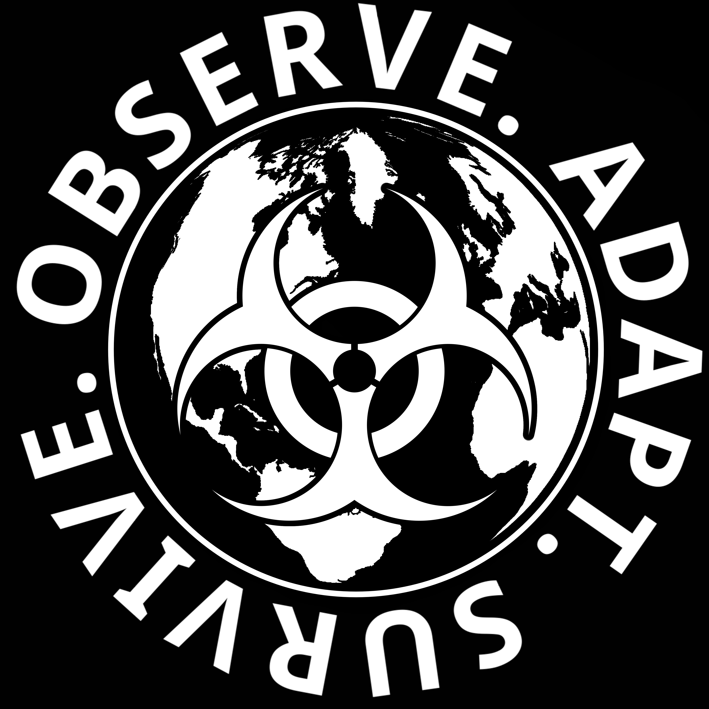

# Cryptobiology Anomaly Reseach (CAR) Org.

CAR exists to identify and document lifeforms operating outside known terrestrial parameters.  

These “cryptobiological anomalies” exhibit morphological, biochemical, or ecological patterns inconsistent with current biological models, posing threat vectors to human infrastructure, climate stability, or biospheric equilibrium.

> *"Our job is not to explain the impossible.  
> It is to measure it, map it, and survive it."*  
> - CAR Director [NAME REDACTED]

---

### DIVISIONAL STRUCTURE

| Division Code | Division Name | Function |
| :---: | :--- | :--- |
| **BIO** | Xenobiology & Comparative Anatomy | Dissection, classification, morphological mapping |
| **ECO** | Ecological Threat Modeling | Climate-habitat simulations, range projection, impact assessments |
| **OPS** | Field Operations Unit | Containment, neutralization, recovery of live specimens and tissue |
| **COMS** | Communication & Psychological Ops | Threat advisories, misinformation control, civilian compliance |
| **TECH** | Applied Containment Engineering | Weaponized deterrents, sensor nets, environmental manipulation |
| **ARC**  | Archival & Records Command | Secure cataloging of all cryptobiological data and media assets |

---

### THREAT CLASSIFICATION

| Class | Description |
| :---: | :--- |
| **TC1** | Harmless / Non-invasive |
| **TC2** | Locally hazardous |
| **TC3** | Regional Alpha-threat, climate-adaptive |
| **TC4** | Global existential hazard |

---

### Database navigation

- **[Species Database](../species/index.md)** - Verified cryptobiological anomaly dossiers.  
- **[Field Reports](../field/index.md)** - Active and historical incident logs.  
- **[Experiment Logs](../experiment/index.md)** - Containment and behavioral studies.  
- **[Communications](../coms/index.md)** - Civilian advisories and internal dispatches.  
- **[Organization Records](../organization/index.md)** - Structure, policy, and personnel.  
- **[Template files](../templates/index.md)** - Template files for new database entries.

---

### Organization files

- **[Personnel](./personel/index.md)** - Personnel information and history.